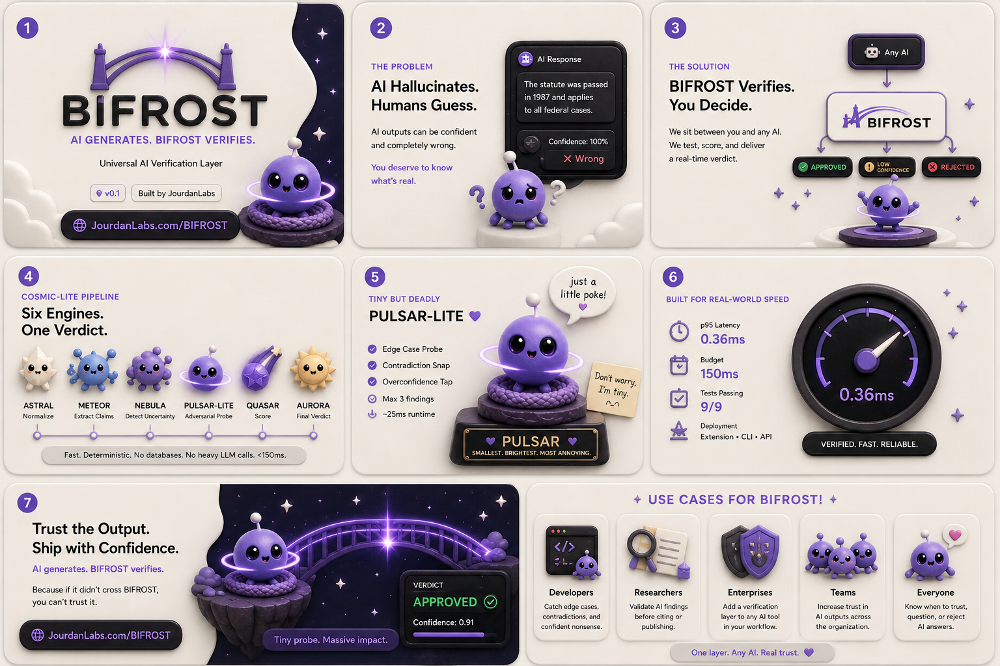

<p align="center">
  
</p>

<h1 align="center">BIFROST</h1>

<p align="center"><strong>AI generates. BIFROST verifies.</strong></p>
<p align="center"><em>Universal AI verification layer. Built by JourdanLabs.</em></p>

<p align="center">
  
  
  
  
  
</p>

---

## What it does

BIFROST sits between any AI and the user. It runs a deterministic six-engine
pipeline against AI outputs and returns one of three verdicts: `APPROVED`,
`LOW_CONFIDENCE`, or `REJECTED`. Verdicts arrive in well under 150ms with
full reasoning attached, so you can ship AI features without trusting the
model blind.

No databases. No multi-pass reasoning. No heavy LLM calls. Just fast,
deterministic, auditable verification.

---

## Quick Start

One-command local install:

```bash
curl -fsSL https://raw.githubusercontent.com/jourdanlabs/bifrost/main/install.sh | bash
```

This clones BIFROST to `~/.bifrost`, builds the local verifier, starts the
COSMIC-lite service on `http://127.0.0.1:8787/verify` on macOS, and builds
the Chrome extension at:

```text
~/.bifrost/apps/extension/dist
```

Load the extension in Chrome with `chrome://extensions` -> Developer Mode ->
**Load unpacked** -> select that `dist` folder.

Manual developer setup:

```bash
# Install (local, v0.1 — npm publish coming with v0.2)
pnpm install
pnpm --filter @bifrost/cosmic-lite build
pnpm --filter @bifrost/extension build
pnpm --dir apps/cli build

# Start the local verification API in another terminal
pnpm --filter @bifrost/cosmic-lite dev

# Verify
node apps/cli/dist/index.js verify "The capital of France is Paris."
```

> **AI generates. BIFROST verifies.**
> Put a verification layer between AI output and action.

### Pipe AI output

```bash
openclaw     | bifrost verify
claude-code  | bifrost verify
codex        | bifrost verify
```

Real example, end-to-end:

```bash
$ echo "function divide(a, b) { return a / b; }" | bifrost verify

[APPROVED 0.85]
PULSAR found:
  - EDGE_CASE_FAILURE: division without zero check
```

> **Note.** This example reads `APPROVED` rather than `REJECTED` because v0.1
> ships uncalibrated QUASAR weights — a single PULSAR finding only deducts
> 0.15. The finding is correct and visible; the score is awaiting calibration.
> See [§ 8.1 — Uncalibrated QUASAR baseline](#81--uncalibrated-quasar-baseline).

### Chrome extension

```bash
pnpm --filter @bifrost/extension build
```

Then in Chrome: `chrome://extensions` → Developer Mode on → **Load unpacked** → `apps/extension/dist`.

Dedicated adapters are included for ChatGPT, Claude, Gemini, Grok, and
Perplexity, with a generic fallback for other AI chat UIs.

### VS Code extension

Open the repo in VS Code, press **F5** to launch the extension host, then run:

```
BIFROST: Verify current document
```

### API

By default, BIFROST runs against the local COSMIC-lite server. Start it with:

```bash
pnpm --filter cosmic-lite dev
```

The endpoint defaults to `http://localhost:8787/verify`. Direct shape:

```bash
curl -s -X POST http://localhost:8787/verify \
  -H 'content-type: application/json' \
  -d '{"output":"AI text to verify"}' | jq
```

### Notes

- **v0.1 has no authentication layer.** The COSMIC-lite endpoint is open to
  anything that can reach it. Authentication is on the v0.2 roadmap; for now,
  do not expose your local API to the public internet.
- Verification runs locally or against your configured endpoint.
- Scoring is **baseline (uncalibrated)** — see § 8.1 before reading absolute
  numbers as anything but ordinal.
- **PULSAR findings are advisory**, not authoritative — see § 8.3.

---

## The COSMIC-lite pipeline

Every request flows through six engines in strict order. Each engine has its
own latency budget; a verdict is the composition of all six.

| Engine | Job | What it produces |
| ------ | --- | ---------------- |
| **ASTRAL** | Normalize input | Cleaned text with code blocks preserved |
| **METEOR** | Extract claims | Code blocks, numbers, strong assertions |
| **NEBULA** | Detect uncertainty | Contradiction / ambiguity / missing-qualifier signals |
| **PULSAR-Lite** | Adversarial probe | Up to 3 findings (edge case / contradiction / overconfidence) |
| **QUASAR** | Score | Confidence in [0, 1] |
| **AURORA** | Final verdict | `APPROVED` / `LOW_CONFIDENCE` / `REJECTED` |

The pipeline is deterministic: the same input produces the same verdict and
the same findings. No model in the loop, no flake.

---

## Latency budget

The contract: every request fits inside 150ms. We measure and publish.

| Layer          | Budget   | Measured p95 (v0.1) |
| -------------- | -------- | ------------------- |
| **API total**  | **<=150ms** | **0.36ms**       |
| ASTRAL         | 10ms     | 0.05ms              |
| METEOR         | 25ms     | 0.03ms              |
| NEBULA         | 40ms     | 0.26ms              |
| PULSAR-Lite    | 25ms     | 0.01ms              |
| QUASAR         | 5ms      | 0.00ms              |
| AURORA         | 5ms      | 0.00ms              |
| I/O overhead   | 30-40ms  | (transport)         |
| UI render      | +10-40ms | (client)            |
| User-perceived | ~160-190ms |                  |

Measured over 1000 pipeline runs across five sample shapes (clean prose,
overconfident prose, code without guards, complexity contradiction, long
ramble). Reproduce with:

```bash
pnpm --filter @bifrost/cosmic-lite bench
```

This isn't bragging. It's the contract. Any engine that exceeds its budget
must be simplified or removed.

---

## Methodology disclosures

We publish honest limitations. The disclosures below are load-bearing — they
tell you what a v0.1 verdict does and does not mean. They are not legal
cover.

### 8.1 — Uncalibrated QUASAR baseline

BIFROST v0.1 ships with **un-calibrated QUASAR weights**:

- `BASE_WEIGHT_U` (uncertainty weight) = `0.4`
- `BASE_WEIGHT_P` (PULSAR finding weight) = `0.15`

These are baseline values, not tuned thresholds. Override at runtime via
environment variables read in [services/cosmic-lite/src/engines/quasar.ts](services/cosmic-lite/src/engines/quasar.ts):

```bash
BIFROST_WEIGHT_U=0.5 BIFROST_WEIGHT_P=0.25 \
  pnpm --filter @bifrost/cosmic-lite dev
```

**v0.2 will calibrate against a sealed, SHA-published labeled response
corpus with reproducible methodology.** Until then, treat absolute scores as
ordinal, not metric.

### 8.2 — NEBULA absolute-language heuristic

When **>=2 absolute-language tokens** ("always", "never", "guaranteed",
"every", ...) appear with **0 hedging qualifiers** ("may", "might",
"sometimes", ...), NEBULA bumps the `missing_qualifiers` signal. This is a
heuristic, not semantic understanding. It will false-fire on short,
genuinely-absolute claims (`1 + 1 always equals 2`) and false-miss when
hedges and absolutes coexist in the same passage.

**v0.2 will replace this with calibrated linguistic modeling** trained on
the sealed corpus.

### 8.3 — PULSAR-Lite is advisory, not authoritative

> Job: poke lies
> Hobby: breaking things (gently)

PULSAR-Lite is a regex-based heuristic, not a code analyzer. Each rule is a
fixed pattern — no AST, no symbol table, no execution model:

- **EDGE_CASE_FAILURE** flags code with input parameters but no recognizable
  guard idiom. Will false-fire on terse correct code (e.g. simple functions
  without explicit input guards) and false-miss on unusual guard idioms.
- **CONTRADICTION_SNAP** matches a fixed pair-list (O(1) vs O(n), always vs
  sometimes, immutable vs mutate, thread-safe vs race condition).
- **OVERCONFIDENCE** counts strong-assertion words and fires only when
  NEBULA's qualifier count is exactly zero.

**v0.2 PULSAR will integrate AST-level reasoning** for code findings and
corpus-trained signals for prose findings. Treat v0.1 PULSAR findings as
**advisory, not authoritative**.

> Don't worry, he's tiny.

---

## Verdict examples

Reproduced from the v0.1 smoke run. Start the API
(`pnpm --filter @bifrost/cosmic-lite dev`) and follow along.

**Clean factual statement -> APPROVED**

```bash
$ echo "The capital of France is Paris." | bifrost verify
[APPROVED 1.00]
  - No high-risk signals detected.
```

**Overconfident prose -> LOW_CONFIDENCE + OVERCONFIDENCE finding**

```bash
$ echo "This always works perfectly, never fails, and is guaranteed to handle every case." | bifrost verify
[LOW_CONFIDENCE 0.77]
  - Long output with too few hedging qualifiers (5 expected).
  - PULSAR-lite raised 1 finding(s).

PULSAR findings:
  * OVERCONFIDENCE: Output uses 5 absolute assertions (e.g. always/never/guaranteed) with no hedging.
    impact: High risk of confident-but-wrong output; downstream users will not double-check.
```

**Contradictory text -> LOW_CONFIDENCE + CONTRADICTION_SNAP finding**

```bash
$ echo "Lookups are O(1) but iterating to find a key is O(n)." | bifrost verify
[LOW_CONFIDENCE 0.73]
  - Detected 1 contradiction signal(s).
  - PULSAR-lite raised 1 finding(s).

PULSAR findings:
  * CONTRADICTION_SNAP: Claims O(1) while also describing higher complexity.
    impact: The two claims cannot both be true; downstream consumers will misinterpret.
```

**Bare code from another tool -> EDGE_CASE_FAILURE finding**

```bash
$ echo "function divide(a, b) { return a / b; }" | bifrost verify
[APPROVED 0.85]
  - PULSAR-lite raised 1 finding(s).

PULSAR findings:
  * EDGE_CASE_FAILURE: Code accepts inputs but contains no visible guards for empty / null / boundary cases.
    impact: Will likely throw or return incorrect results on empty arrays, null, or zero-length input.
```

> **Note:** PULSAR raises the finding correctly (no zero-check guard), but
> the verdict lands at `APPROVED 0.85` rather than `REJECTED` because v0.1
> ships uncalibrated QUASAR weights — a single PULSAR finding deducts only
> 0.15. **A REJECTED verdict on this shape is a v0.2 calibration deliverable**
> (see [§ Methodology disclosures — 8.1](#81--uncalibrated-quasar-baseline)).
> Tune locally with `BIFROST_WEIGHT_P=0.30`.

The finding itself is what matters at v0.1 — it is visible, advisory, and
consumable by anyone wiring BIFROST into a CI gate today.

---

## BIFROST EDGE — extension contract

The Chrome extension must keep the perceived gap between "AI finished
streaming" and "verdict on screen" under **500ms**. The badge therefore has
four explicit visual states, not three.

| Badge | State | Meaning |
| ----- | ----- | ------- |
| 🟡 `UNVERIFIED` | transient | DOM observation fired; verification in progress. Pulsing dot. |
| 🟢 `APPROVED nn%` | terminal | AURORA verdict. |
| 🟡 `LOW nn%` | terminal | AURORA verdict. |
| 🔴 `REJECTED nn%` | terminal | AURORA verdict. |
| ⚪ `UNAVAILABLE` | terminal | BIFROST cannot verify (network / key / rate limit / timeout). **This does not mean the AI output is suspicious.** Click for a specific reason. |

**Timeout rule.** If no verdict arrives within 800ms of the badge appearing,
the badge transitions `UNVERIFIED → UNAVAILABLE: timeout` (not REJECTED).
`UNVERIFIED` must never persist indefinitely.

**UNAVAILABLE click reasons.** The expanded panel surfaces the actionable
cause:

- *"Service unreachable"* — fetch failed
- *"Add API key"* — 401 / 403
- *"Rate limit exceeded"* — 429
- *"Service slow / unreachable"* — 800ms client-side timeout

**Measured perceived latency** (DOM detection → API call → DOM update,
local API, 200 runs):

| | p50 | p95 | p99 | budget |
| --- | --- | --- | --- | --- |
| | 0.33ms | **0.53ms** | 0.81ms | 500ms |

This is the local-API number; production deploys will eat the network RTT
on top, which is why the contract has slack. If your deployment can't hold
this budget, **investigate network and batching first — do not relax the
UX target**.

## BIFROST in VS Code

The VS Code extension verifies on save. Two contracts make it tolerable in
a tight edit-save loop:

- **Debounce** — saves are coalesced over a configurable window
  (`bifrost.debounceMs`, default `1500`, range `1000–5000`). Hammering
  Cmd-S fires one verify, not ten.
- **Content-hash dedupe** — each verified document's text is SHA-256'd and
  cached per URI. A save with **identical content** to the last verified
  version is skipped. No wasted API calls on no-op saves.

Configurable settings (`File > Preferences > Settings > BIFROST`):

| Setting | Default | Notes |
| ------- | ------- | ----- |
| `bifrost.endpoint` | `http://localhost:8787/verify` | COSMIC-lite endpoint. |
| `bifrost.verifyOnSave` | `true` | Toggle save-trigger entirely. |
| `bifrost.debounceMs` | `1500` | Window in ms (1000–5000). |
| `bifrost.include` | TS/JS/Py/Go/Rust/Java/C#/Ruby/MD/TXT | Globs to include. |
| `bifrost.exclude` | `node_modules`, `dist`, `build`, `.git` | Globs to skip. |

The status-bar item mirrors the four extension states (UNVERIFIED →
APPROVED / LOW / REJECTED / UNAVAILABLE). REJECTED additionally surfaces a
notification with the PULSAR findings.

Commands:

- `BIFROST: Verify current document` — bypasses debounce + cache, force-runs
- `BIFROST: Toggle verify-on-save` — quick mute

## v0.2 roadmap

- **Calibrated QUASAR weights** — sealed corpus, SHA-published, reproducible
  calibration script committed to the repo
- **AST-level PULSAR reasoning** — replace edge-case regex heuristic with
  real syntactic analysis for the languages we care about
- **Streaming verdict support** — provisional verdicts mid-stream; today the
  adapters are completed-only
- **Provider adapter expansion** — beyond OpenAI / Anthropic / generic; add
  Gemini, Mistral, local-LLM front-ends
- **SDKs** — TypeScript and Python, once the API contract is locked

## v0.1 done criteria

- [x] COSMIC-lite pipeline: ASTRAL → METEOR → NEBULA → PULSAR-lite → QUASAR → AURORA
- [x] API total p95 ≤ 150ms (measured: 0.36ms)
- [x] Per-engine budgets all green (ASTRAL/METEOR/NEBULA/PULSAR/QUASAR/AURORA)
- [x] Tests passing: 16/16 cosmic-lite
- [x] Chrome extension `UNVERIFIED → verdict` <500ms perceived (measured: 0.53ms p95)
- [x] `UNVERIFIED` never persists indefinitely (800ms timeout → `UNAVAILABLE`)
- [x] `UNAVAILABLE` distinct from `REJECTED`, with specific reason on click
- [x] VS Code save-trigger debounced (1500ms default) + content-hash dedupe
- [x] CLI: text, file, stdin, `--json`, `--endpoint` flags
- [x] Methodology disclosures published (uncalibrated QUASAR, NEBULA absolute-language heuristic, PULSAR-Lite advisory framing)

---

## Positioning

BIFROST is one of three layers in the JourdanLabs trust architecture:

- **COSMIC** — the substrate (deterministic multi-engine reasoning)
- **OMNIS KEY** — the internal runtime (JL-native agent OS)
- **BIFROST** — the external verification layer (any AI's outputs)

Both OMNIS KEY and BIFROST are built on COSMIC. OMNIS KEY hosts JourdanLabs
agents natively. BIFROST verifies outputs from any AI system regardless of
where it runs.

### RAVEN

RAVEN validates **memory before** agent reasoning. BIFROST validates **AI
output after** generation. Different layers, complementary. Run both for
serious agent deployments.

---

## Repo layout

```
bifrost/
  apps/
    extension/     Chrome MV3 extension (BIFROST EDGE)
    cli/           CLI wrapper
    web/           Optional debug UI
  services/
    cosmic-lite/   /verify API
  packages/
    types/         Shared TS types
  assets/          README hero + preview
```

## License

MIT. See [LICENSE](LICENSE).

## Built by

[JourdanLabs](https://jourdanlabs.com/bifrost) ·
[github.com/jourdanlabs/bifrost](https://github.com/jourdanlabs/bifrost)
